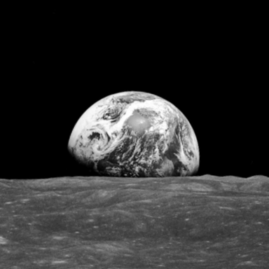

# Moonrise Engine

A small, cross platform and web friendly 3D component-based game engine with lua scripting.



## Docs

Game data must go in `webgpu_resources/resources/`

The Lua api is defined in `engine.lua`

An example game can be found at https://github.com/RCoder01/sigmakart.

## Build instructions

Use `cmake` to build the project. The following commands can be used:

For dawn backend:
```bash
cmake -DWEBGPU_BACKEND=DAWN -B build_dawn
cmake --build build_dawn
```
- Note: SDL2 is required (SDL_mixer, SDL2) and must be downloaded/installed/packaged separately

For wgpu backend:
```bash
cmake -DWEBGPU_BACKEND=WGPU -B build_wgpu
cmake --build build_wgpu
```
- Note: SDL2 is required (SDL_mixer, SDL2) and must be downloaded/installed/packaged separately
- Note: you must provide the wgpu shared shared library, the version used is wgpu-native-0.19.4.1

For emscripten backend:
```bash
emcmake cmake -B build_web
cmake --build build_web
```
- Note: emscripten should be setup first
- Note: webgpu_resources should be in the same directory as the project in order to correctly generate web bundle artifacts
